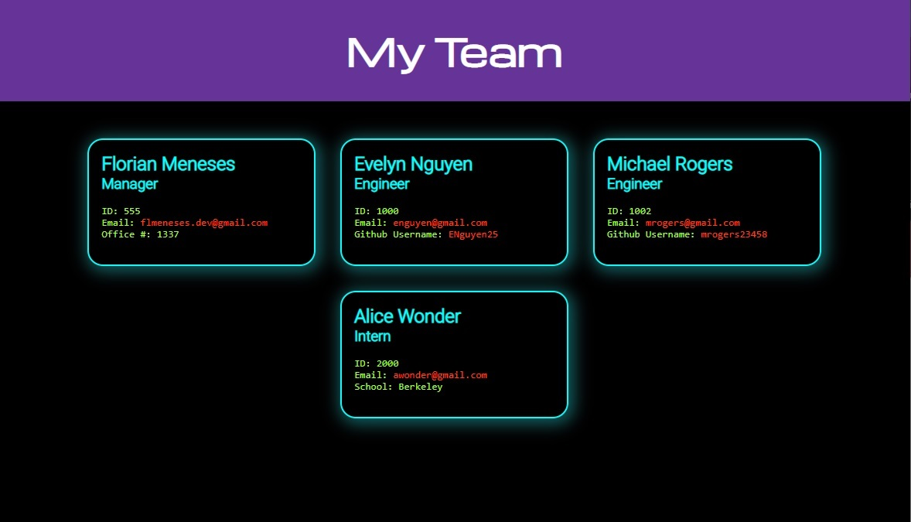

# Team Profile Generator

## Description:

---
This is an application I built to dynamically generate a Team Profile.

### https://github.com/Myuze/team-profile-gen
---

## Table of Contents:

---
1. [Installation Instructions](#installation-instructions)
2. [Usage](#usage)
3. [Test Instructions](#test-instructions)
4. [Contribute](#contribute)
5. [Licenses](#licenses)
6. [Questions](#questions)

## Installation Instructions:

---
1. Install, `node.js`.
2. Clone the application repository.
3. In the repository root, in the CLI, `npm install`.
4. Then, `node index.js`.
5. Follow the prompts.

## Usage:

---
You are welcome to use this application as needed.

## Test Instructions:

---
From the repository:
1. In the CLI, `npm run test`.

## Contribute:

---
- If you would like to contribute you can contact me on Github or by Email.

## Licenses:

---

**MIT License**
Copyright &#169; <YEAR> <NAME>

## Questions:

---

### What is your Github username?

[Myuze](https://github.com/Myuze)

### If you have any other questions, you can reach me at:

[flmeneses.dev@gmail.com](mailto:flmeneses.dev@gmail.com)
